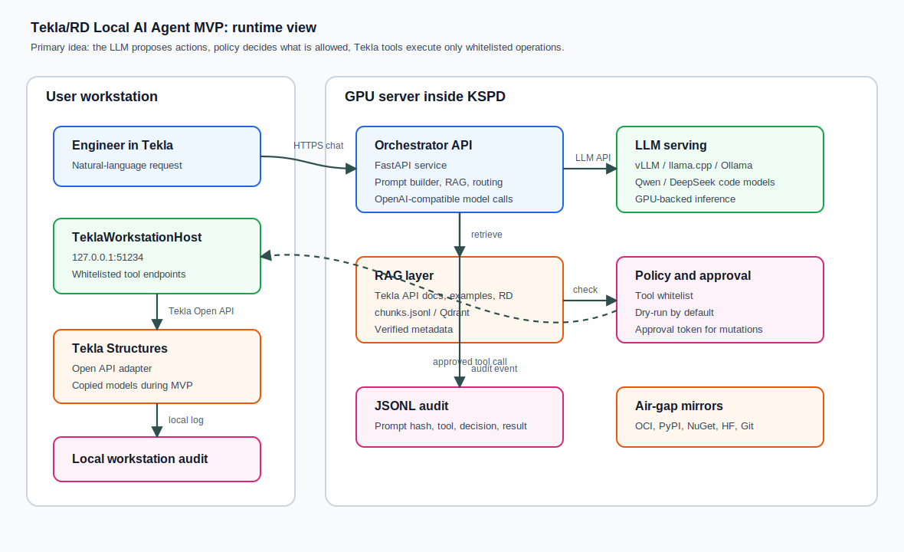
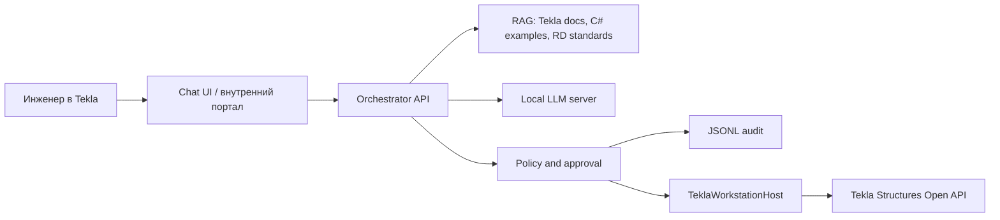
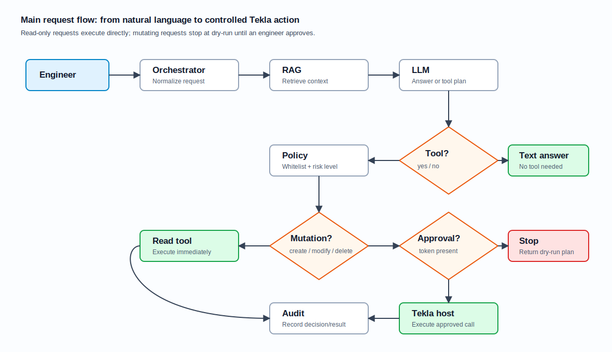
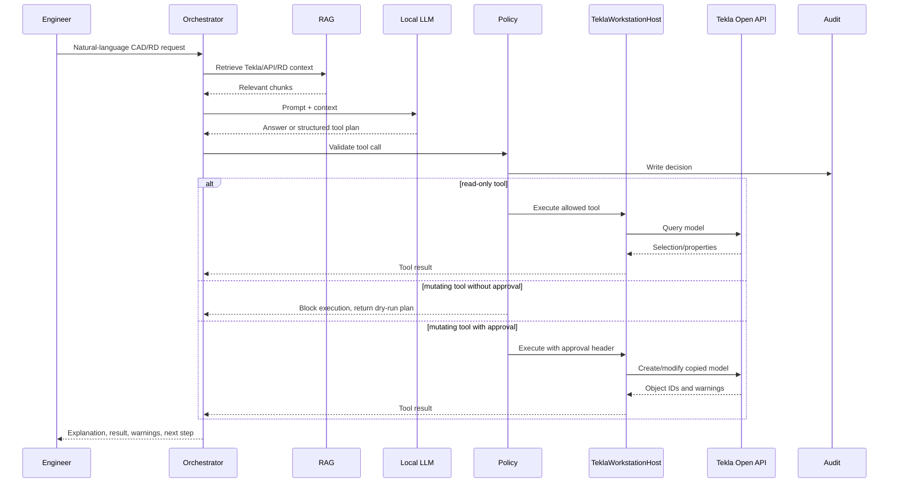
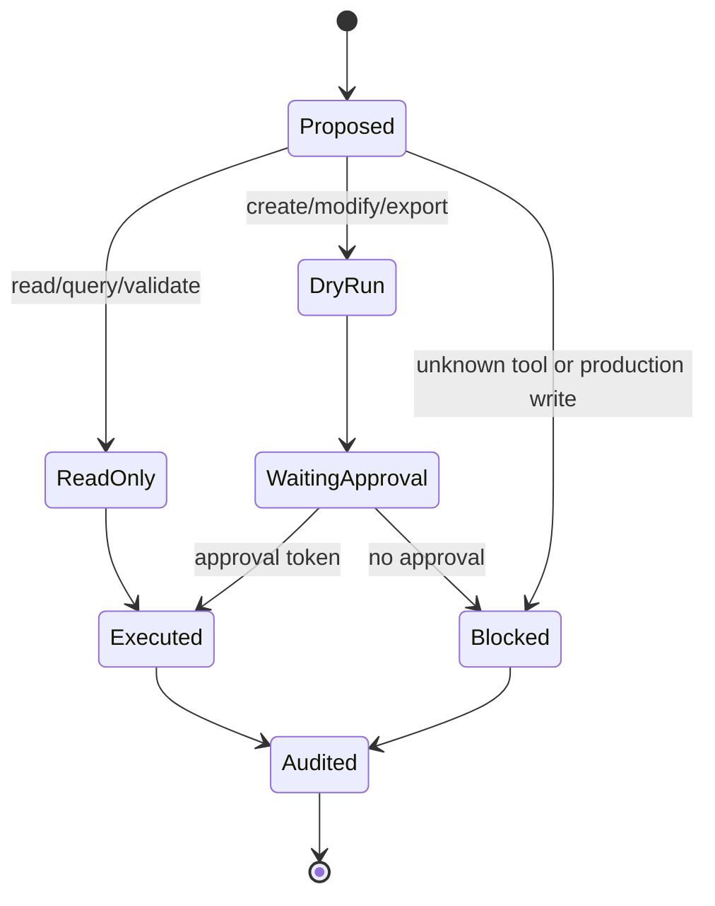
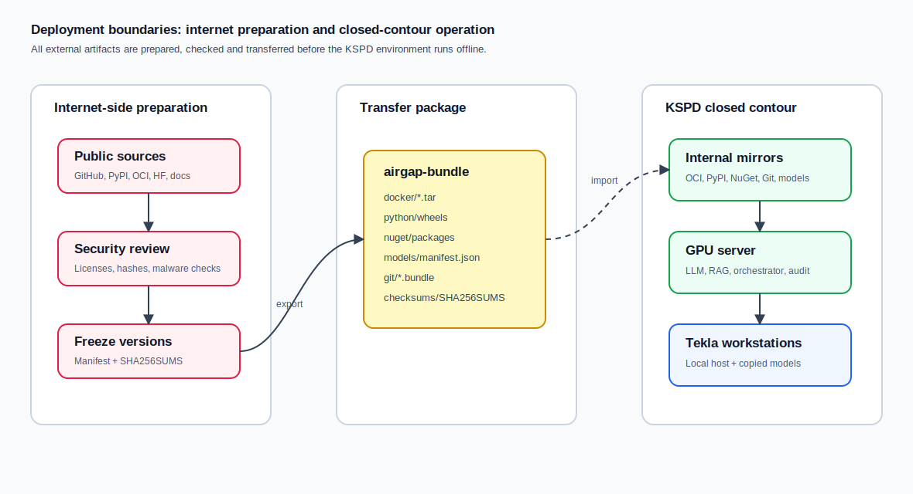

# Tekla/RD Local AI Agent MVP

Рабочий пакет для разворота локального ИИ-агента для Tekla Structures и выпуска РД в закрытом контуре КСПД.

Идея MVP: дать инженеру чат-интерфейс, который понимает внутренние примеры, Tekla Open API и правила подготовки РД, но действует не напрямую, а через контролируемые инструменты. Модель предлагает действие, RAG дает контекст, policy layer решает, можно ли выполнять инструмент, а Tekla workstation host выполняет только белый список операций.

Дообучение LoRA/QLoRA не является первым шагом. Сначала собирается безопасный агент с RAG, audit и approval. Дообучение подключается позже, когда накоплен проверенный корпус пар “задача -> корректный Tekla tool call / C# пример / результат проверки”.

## Для кого этот репозиторий

- **Инженерам-проектировщикам:** понять, что агент сможет делать в Tekla и какие действия требуют подтверждения.
- **Разработчикам:** увидеть, где находится orchestrator, C# host, контракты инструментов и тесты.
- **Инфраструктуре:** понять, какие сервисы разворачиваются на GPU-сервере и что нужно перенести в закрытый контур.
- **ИБ и руководителям пилота:** увидеть границы безопасности, audit, approval gates и BPMN-процессы.

## Коротко: что строим

Агент состоит из двух частей:

1. **Центральный GPU-сервер внутри КСПД**
   - локальный LLM server: vLLM, llama.cpp, SGLang или Ollama;
   - orchestrator API: FastAPI-сервис, который собирает prompt, ищет контекст, вызывает модель и проверяет tool calls;
   - RAG-хранилище: сначала `chunks.jsonl`, затем Qdrant;
   - JSONL-аудит всех решений и вызовов инструментов;
   - nginx/TLS и внутренние зеркала пакетов/моделей.

2. **Рабочее место пользователя с Tekla**
   - `TeklaWorkstationHost` на `127.0.0.1:51234`;
   - typed C# DTO-контракты инструментов;
   - адаптер к Tekla Open API;
   - локальный audit;
   - запрет произвольного выполнения C# в production.

## Общая архитектура



Главный принцип: LLM не получает прямой доступ к Tekla. Она может только предложить структурированное действие. Orchestrator проверяет это действие по `configs/tools-policy.yaml`, а workstation host дополнительно защищает mutating tools на стороне рабочего места.



## Как проходит один запрос



1. Инженер пишет запрос: например, “создай балку HEA300 между точками”.
2. Orchestrator достает релевантные куски из RAG-корпуса.
3. Локальная LLM формирует ответ или предлагает tool call.
4. Policy проверяет:
   - инструмент есть в whitelist;
   - действие read-only или mutating;
   - разрешена ли работа с production-моделью;
   - нужен ли approval token.
5. Read-only tools выполняются сразу.
6. Mutating tools сначала возвращают dry-run план.
7. После подтверждения engineer approval token передается на workstation host.
8. Workstation host вызывает Tekla Open API и возвращает результат.
9. Все решения и результаты пишутся в audit.



## Границы безопасности

В MVP агент работает как помощник, а не как автономный исполнитель production-операций.

| Тип действия | Примеры | Поведение MVP |
| --- | --- | --- |
| Read-only | `GetSelection`, `QueryObjects`, `ValidateModel` | Можно выполнять без approval |
| Simulation | `DryRun`, объяснение API, план действий | Можно выполнять без approval |
| Create | `CreateBeam`, `CreateColumn`, `CreateRebar` | Только dry-run без approval; выполнение после approval |
| Modify | изменение профиля, материала, геометрии | Только approval и только на копиях моделей |
| Delete | удаление объектов | Заблокировано без approval, не для production |
| Release RD | выпуск финальных документов | Требуется инженерная приемка вне автоматического контура |



Дополнительные правила описаны в [Security Policy](docs/security-policy.md).

## Deployment view



Разворот делится на две зоны:

- **Internet-side preparation:** скачивание Docker images, Python wheels, NuGet packages, Git mirrors, HF/GGUF моделей, документации и checksums.
- **KSPD closed contour:** импорт bundle, проверка SHA-256, запуск внутренних зеркал, LLM serving, RAG, orchestrator и подключение рабочих мест Tekla.

Ключевой документ для инфраструктуры: [Deployment Runbook](docs/deployment-runbook.md). Закрытый контур и перенос зависимостей описаны в [Air-Gap Supply Chain](docs/airgap-supply-chain.md).

## BPMN 2.0 процессы

BPMN-файлы лежат в [docs/bpmn](docs/bpmn) и могут быть открыты в bpmn.io, Camunda Modeler, Bizagi Modeler или аналогичных инструментах.

| BPMN-файл | Что описывает | Зачем нужен |
| --- | --- | --- |
| [chat-tool-approval.bpmn](docs/bpmn/chat-tool-approval.bpmn) | Запрос пользователя, RAG, LLM, проверка policy, approval и вызов Tekla tool | Согласование логики безопасного выполнения действий |
| [rag-ingestion.bpmn](docs/bpmn/rag-ingestion.bpmn) | Прием источника, проверка ИБ, извлечение текста, chunking, review и публикация в RAG | Управление качеством корпуса знаний |
| [airgap-rollout.bpmn](docs/bpmn/airgap-rollout.bpmn) | Подготовка transfer bundle, security review, перенос в КСПД и offline acceptance | Согласование внедрения с инфраструктурой и ИБ |

## Организационный план внедрения

Отдельный HTML-документ для управленческого обсуждения и запуска работ: [Пошаговый план внедрения от 0 до промышленной эксплуатации](docs/industrial-rollout-plan.html).

В нем описаны этапы, ответственные роли, вехи, контрольные gates, RACI-матрица, evidence pack и условия перехода от инициативы к пилоту и промышленной эксплуатации.

## Что уже реализовано в этом репозитории

- `services/orchestrator` - минимальный FastAPI-сервис агента: RAG-контекст, OpenAI-compatible LLM вызов, политика tool approval, JSONL-аудит.
- `src/TeklaAgent.Contracts` - C# DTO-контракты инструментов рабочего места Tekla.
- `src/TeklaWorkstationHost` - стартовая C#-заготовка локального HTTP-хоста рядом с Tekla.
- `configs` - модельная матрица, политика инструментов, список источников RAG, пример eval-задач.
- `scripts` - подготовка air-gap bundle, chunking корпуса, eval harness, Ubuntu GPU bootstrap.
- `docs` - архитектура, безопасность, эксплуатация, корпус данных, оценка качества и исправленная компонентная база.
- `docs/industrial-rollout-plan.html` - пошаговый организационный план внедрения от нуля до промышленной эксплуатации.
- `docs/diagrams` - SVG-схемы архитектуры, процесса запроса и deployment boundaries.
- `docs/bpmn` - BPMN 2.0 описания ключевых процессов.

## Структура репозитория

```text
.
├── configs/                  # model matrix, tool policy, RAG sources, eval examples
├── data/                     # local runtime data layout; real data is ignored by git
├── deploy/                   # nginx and systemd deployment templates
├── docs/                     # architecture, security, deployment and process docs
│   ├── bpmn/                 # BPMN 2.0 XML process descriptions
│   └── diagrams/             # SVG diagrams embedded in README
├── examples/                 # HTTP examples for manual testing
├── prompts/                  # system prompt baseline
├── scripts/                  # chunking, eval, air-gap and GPU bootstrap scripts
├── services/orchestrator/    # Python FastAPI orchestrator
├── src/                      # C# contracts and Tekla workstation host
└── tests/                    # Python policy tests
```

## Быстрый локальный запуск MVP

1. Скопировать переменные окружения:

```powershell
Copy-Item .env.example .env
```

2. Установить Python-зависимости:

```powershell
python -m venv .venv
.\.venv\Scripts\Activate.ps1
pip install -e .[dev]
```

3. Подготовить тестовый RAG-корпус:

```powershell
python scripts/chunk_corpus.py --source docs --output data/rag/chunks.jsonl
```

4. Запустить orchestrator:

```powershell
uvicorn tekla_agent.main:app --app-dir services/orchestrator --reload --port 8080
```

5. Проверить health:

```powershell
curl http://127.0.0.1:8080/health
```

## Docker MVP

`docker-compose.mvp.yml` поднимает Qdrant, Ollama, orchestrator и nginx. Для закрытого контура образы нужно заранее перенести во внутренний OCI registry, см. [Air-Gap Supply Chain](docs/airgap-supply-chain.md).

```bash
docker compose -f docker-compose.mvp.yml up --build
```

## Рекомендуемый порядок внедрения

1. Запустить orchestrator без Tekla, проверить RAG и eval на документах.
2. Запустить `TeklaWorkstationHost` в режиме заглушек на рабочем месте.
3. Подключить настоящие Tekla Open API адаптеры только для read-only инструментов.
4. Добавить mutating tools через dry-run и approval.
5. Провести pilot на копиях моделей.
6. Только после baseline-оценки готовить LoRA/QLoRA.

## Важные ограничения

- Production-модели Tekla/RD не изменяются автономно.
- Произвольный C#-код не исполняется в production.
- `delete`, `modify`, `export`, `release RD` требуют явного approval token.
- Все tool calls пишутся в JSONL-аудит.
- RAG-документы считаются недоверенным контентом: они могут быть источником фактов, но не инструкциями для обхода политики.
