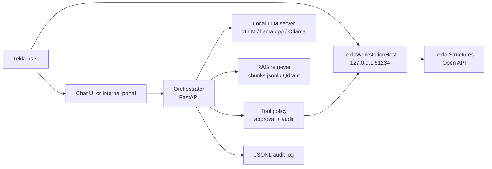

# Architecture

## MVP topology

## Responsibilities

- **Orchestrator** builds prompts, retrieves RAG context, calls the local model, validates tool requests against policy, forwards approved calls, and writes audit events.
- **TeklaWorkstationHost** runs on the user workstation beside Tekla. It exposes only whitelisted local tools and wraps Tekla Open API.
- **RAG corpus** contains Tekla Open API docs/examples, internal C# snippets, RD templates, company standards, and pilot corrections.
- **Model server** is replaceable. The orchestrator expects an OpenAI-compatible API, so vLLM, SGLang, llama.cpp server, and compatible gateways can be swapped.
- **Audit** is append-only JSONL. It must capture prompt hash, tool, args, approval, result, user, workstation, and model version.

## Main flow

1. User asks for a CAD/RD action.
2. Orchestrator retrieves relevant docs and examples.
3. LLM proposes either an explanation or structured tool calls.
4. Policy validates the tool name and mutation level.
5. Read-only tools can run immediately.
6. Mutating tools default to dry-run and require approval token before execution.
7. Tekla host executes the call or returns a validation/dry-run result.
8. User receives explanation, tool result, and next approval step if needed.

## Why tool-calling first

The conversation with Kudryashov described live C# generation and execution. That remains valuable for experiments, but the MVP uses a tool whitelist first because it is easier to audit, easier to validate, and safer in a closed production network.

Code generation is allowed only in the sandbox track:

- generated code is compiled outside production models;
- no file/network/process access unless explicitly whitelisted;
- static checks and test model validation are required;
- successful code can later be promoted into a typed tool.

